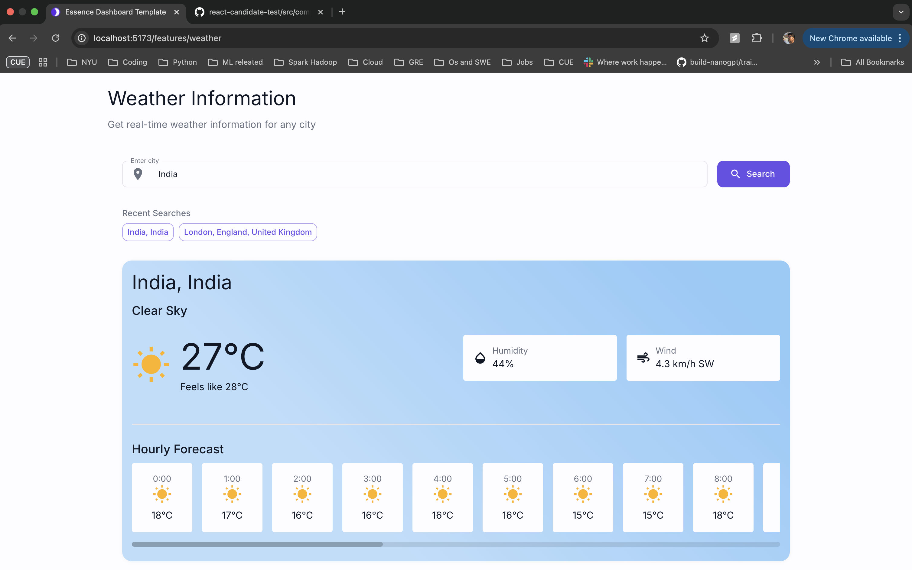
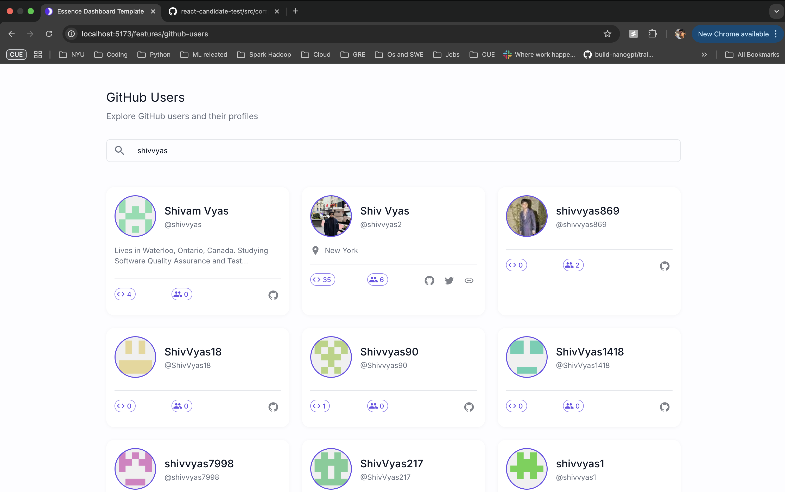
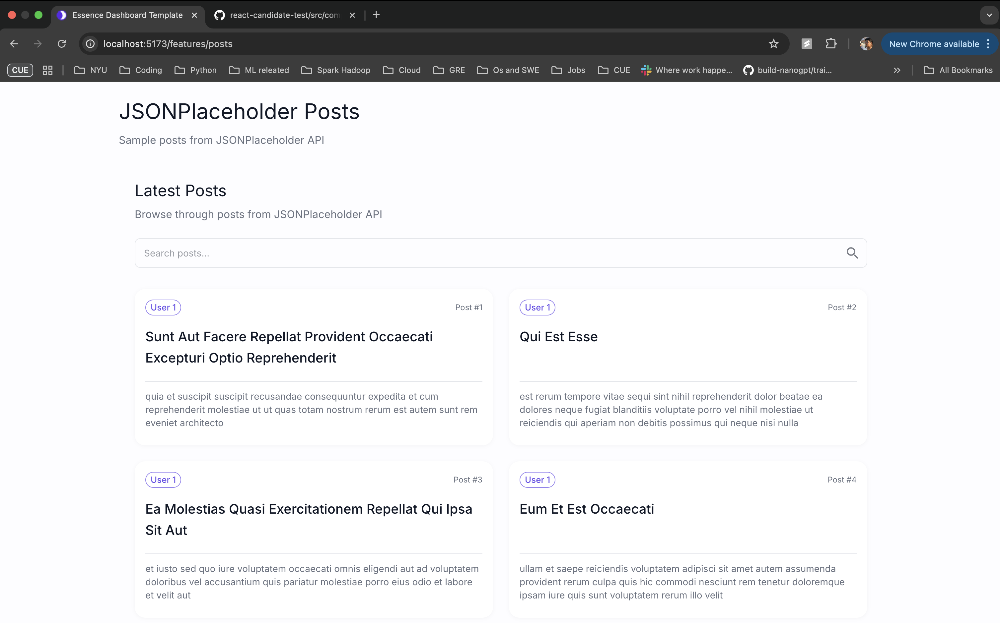
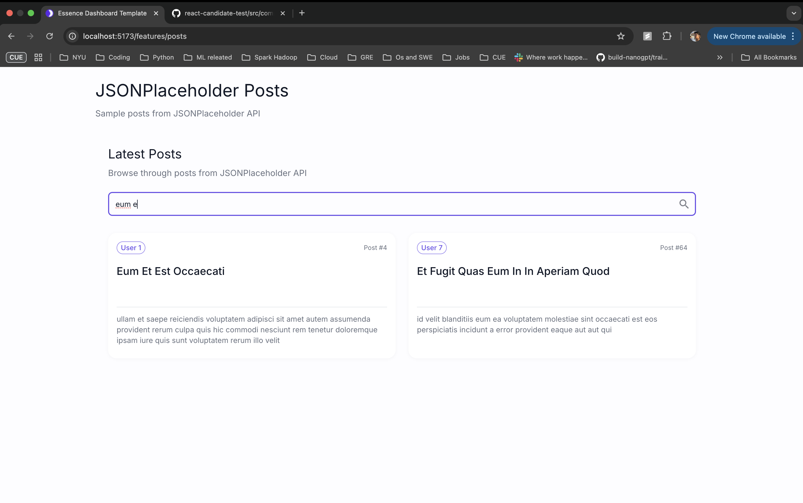
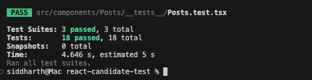
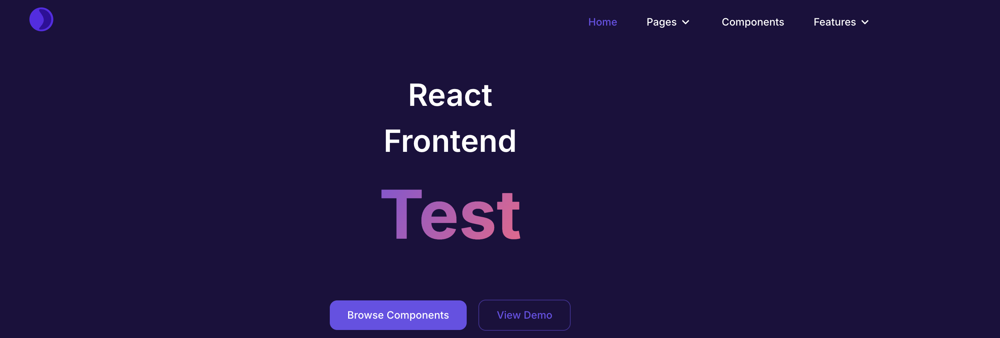

# New Features Implementation

## 1. Weather Component
- Real-time weather data display using OpenWeatherMap API
- Dynamic weather icon based on current conditions
- Temperature display in Celsius
- Loading state handling with skeleton loader
- Error handling for API failures
- Unit tests for component behavior



## 2. GitHub Users Component
- Fetch and display GitHub users data
- User card display with avatar and basic information
- Pagination functionality
- Loading state handling
- Error state management
- Comprehensive unit tests





## 3. Posts Component
- Display posts from external API
- Card-based layout for each post
- Loading state management
- Error handling
- Unit tests for component functionality





## 4. Testing Infrastructure
- Jest configuration setup
- React Testing Library integration
- Mock service worker for API testing
- Test utilities and helpers
- Component-level unit tests
- Integration tests for API calls



## 5. Navigation and Routing
- Added new routes for features
- Updated navigation menu
- Integrated with existing layout
- Proper route protection



## 6. Code Quality and Structure
- TypeScript implementation
- Component organization
- Error boundary implementation
- Loading state management
- Proper type definitions
- Code documentation

## How to Test
1. Weather Component: Navigate to `/features/weather` route
2. GitHub Users: Navigate to `/features/github-users` route
3. Posts: Navigate to `/features/posts` route

Each component has its own test suite that can be run using:
```bash
npm test
```
