# Application Features Documentation

## 1. Dashboard Features

### E-commerce Performance Score (Score: 650)
- **Component**: `ScoreDisplay.tsx`
- **Features**:
  - Displays performance score out of 700
  - Shows percentage change (+5.2%)
  - Visual progress bar indicating score range
  - Real-time score updates
  - Responsive design with Material-UI components
  - Score range display (0-700)

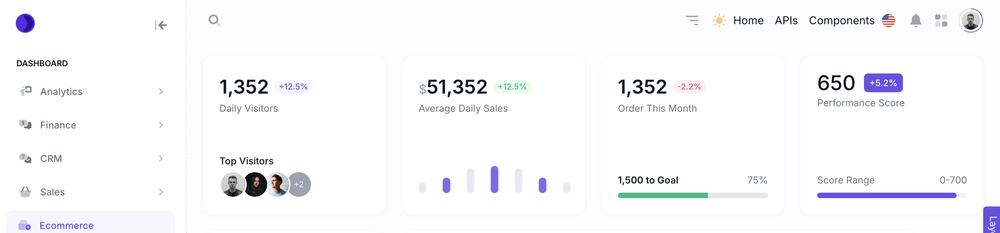

## 2. API Integration Features

### JsonPlaceholder API Integration
- **Endpoint**: https://jsonplaceholder.typicode.com/users
- **Component**: `JsonPlaceholder.tsx`
- **Features**:
  - Fetches and displays user data and posts
  - Implements pagination with configurable items per page
  - Provides sorting functionality (asc/desc)
  - Includes search functionality for posts and users
  - Shows user details including:
    - Name
    - Email
    - Phone
    - Website
    - Company information
    - Address details
  - Displays posts with:
    - Title
    - Body
    - Comments (expandable)
  - Error handling for failed API requests
  - Loading states for better UX
  - Refresh functionality to reload data

- **Features**:
  
  - Profile data fetching with error handling
  - Search functionality for posts and users
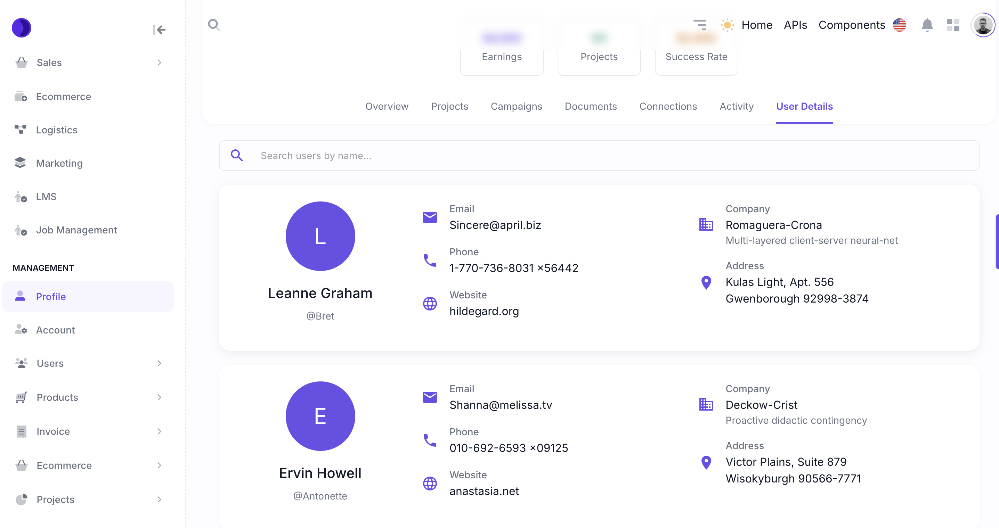
## 3. APIs used in Dashboard
- JsonPlaceholder
- Pokemon
- Weather
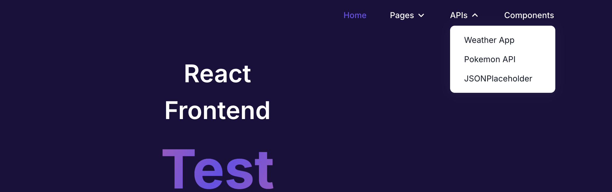
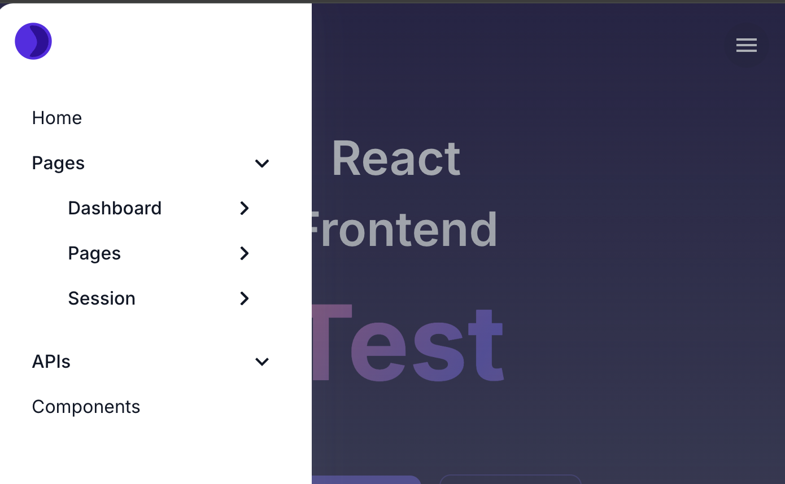

The display is dynamic and I have changed this a bit than the provided one for better experience . 
### 1. Weather API
- **Component**: `Weather.tsx`
- **Endpoint**: https://api.weatherapi.com/v1/
- **React Hooks Used**:
  - useState for managing:
    - searchInput
    - suggestions
    - weather data
    - loading states
    - error handling
    - selected tab
    - last updated time
    - world temperatures
  - useEffect for initial data fetching
- **Features**:
  - Location search with autocomplete
  - Colour changes based on the temperature 
  - Current weather conditions
  - 7-day forecast
  - World temperature map
  - Geolocation support
  - Temperature in Celsius and Fahrenheit
  - Weather conditions with icons
  - Humidity and wind information
  - Interactive world map with major cities
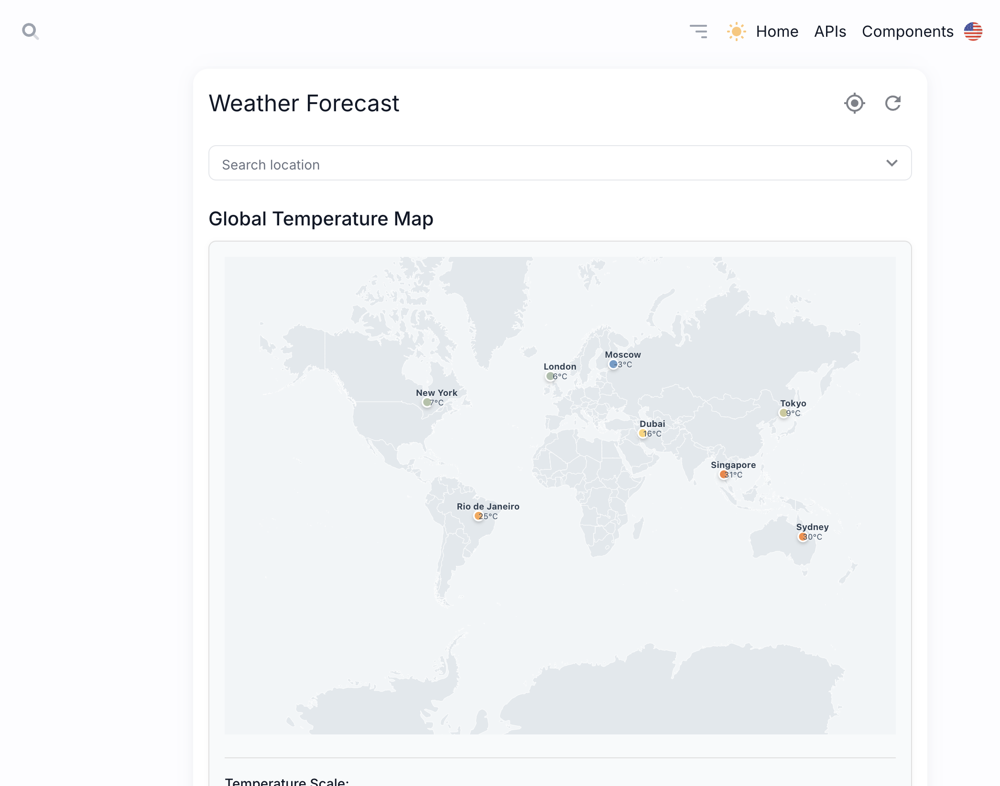
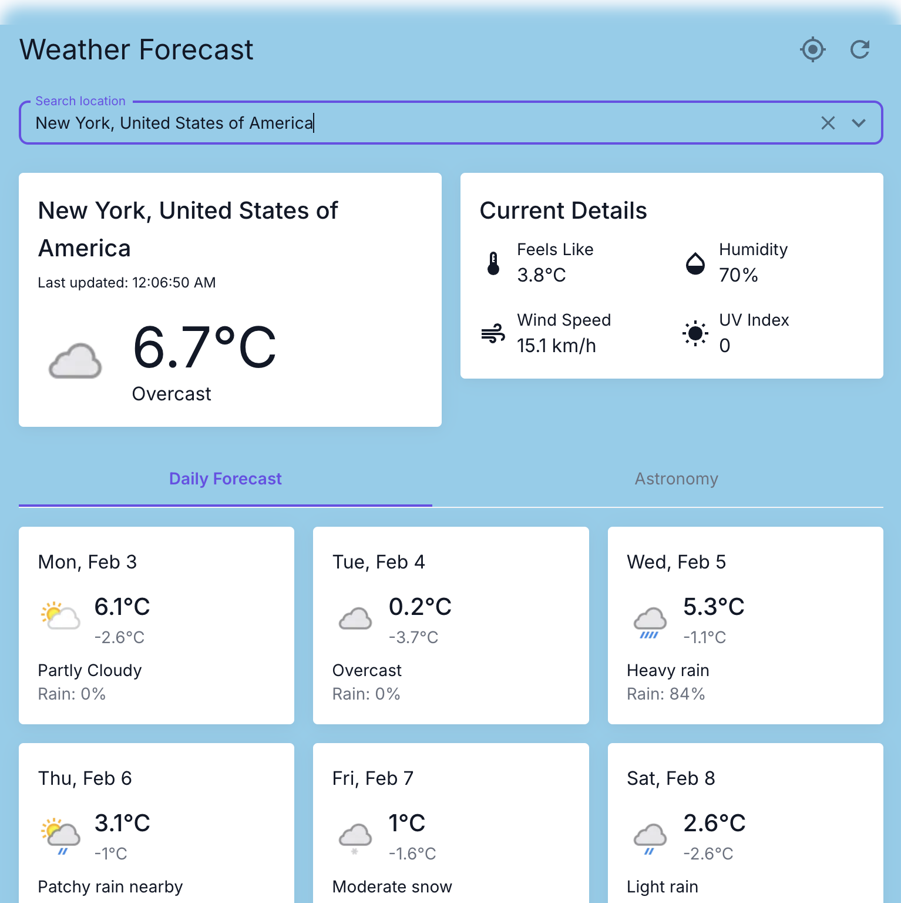
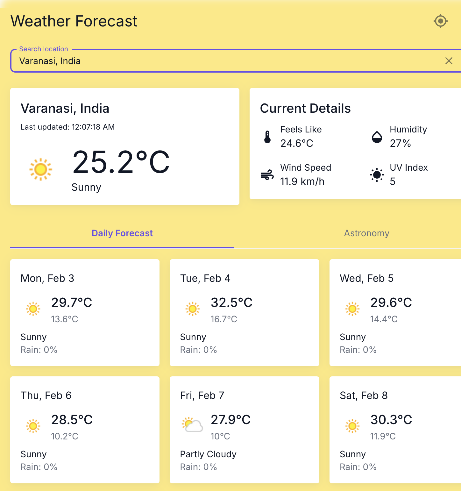
### 2. Pokemon API
- **Component**: `Pokemon.tsx`
- **Endpoint**: https://pokeapi.co/api/v2/
- **React Hooks Used**:
  - useState for:
    - Pokemon data
    - Loading states
    - Error handling
    - Search input
  - useEffect for data fetching
- **Features**:
  - Pokemon search functionality
  - Display Pokemon details:
    - Name and ID
    - Sprite/Image
    - Types
    - Base stats
  - Error handling
  - Loading states
  - Responsive design
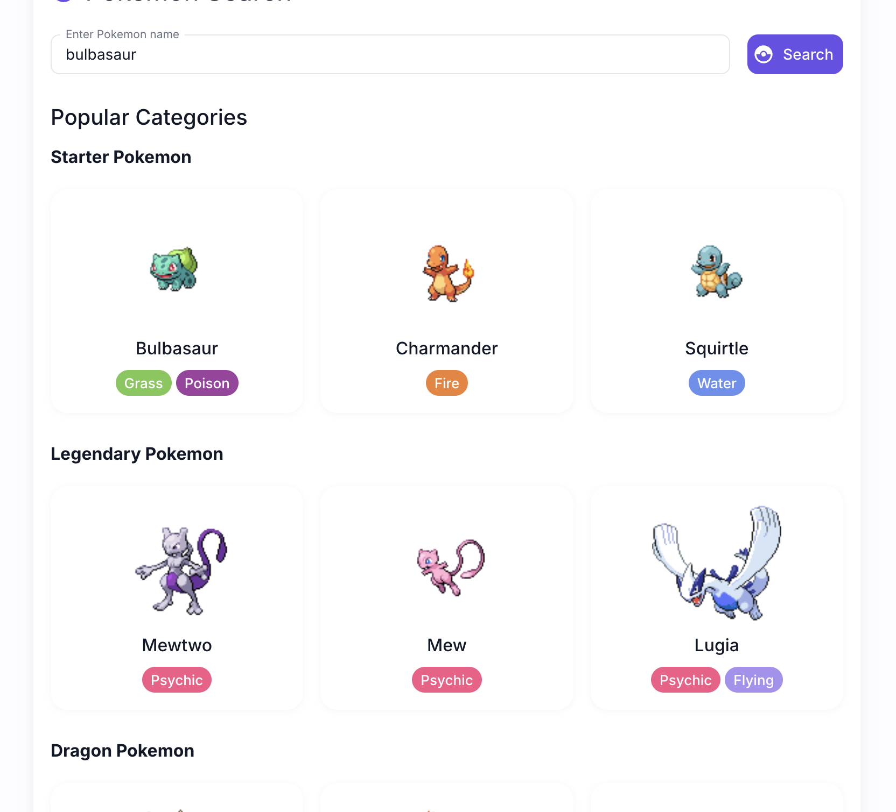
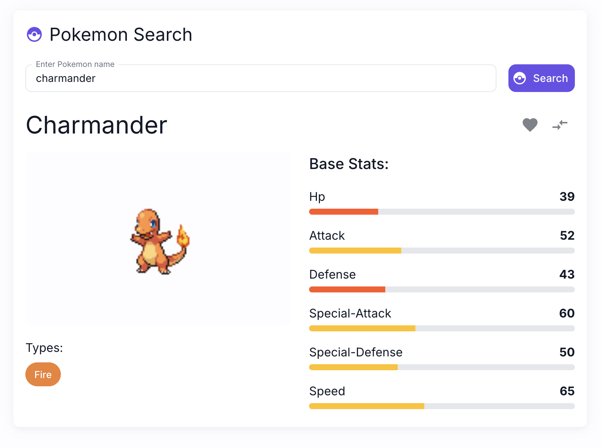

### 3. JSONPlaceholder API
- **Component**: `JsonPlaceholder.tsx`
- **Endpoint**: https://jsonplaceholder.typicode.com/
- **React Hooks Used**:
  - useState for:
    - Posts data
    - Users data
    - Comments
    - Loading states
    - Pagination
    - Sorting
    - Search term
  - useEffect for initial data load
  - useTransition for performance optimization
- **Features**:
  - User profile display
  - Post listing with pagination
  - Comment threading
  - Search functionality
  - Sort capabilities
  - Responsive layout
  - Loading states
  - Error handling
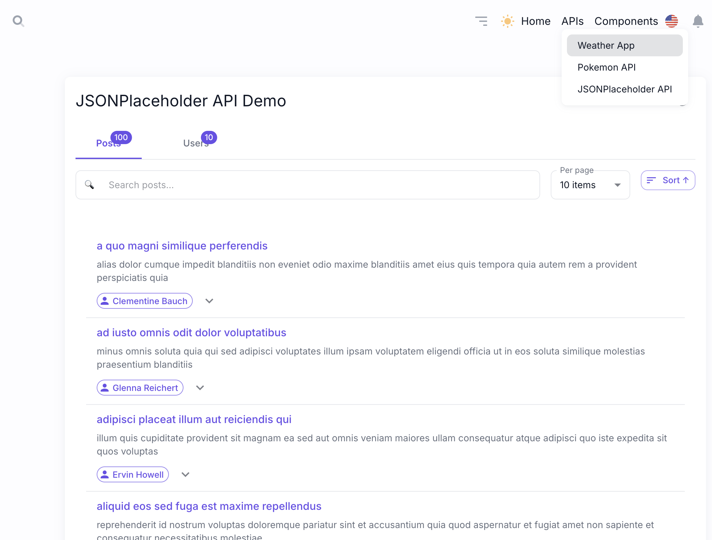
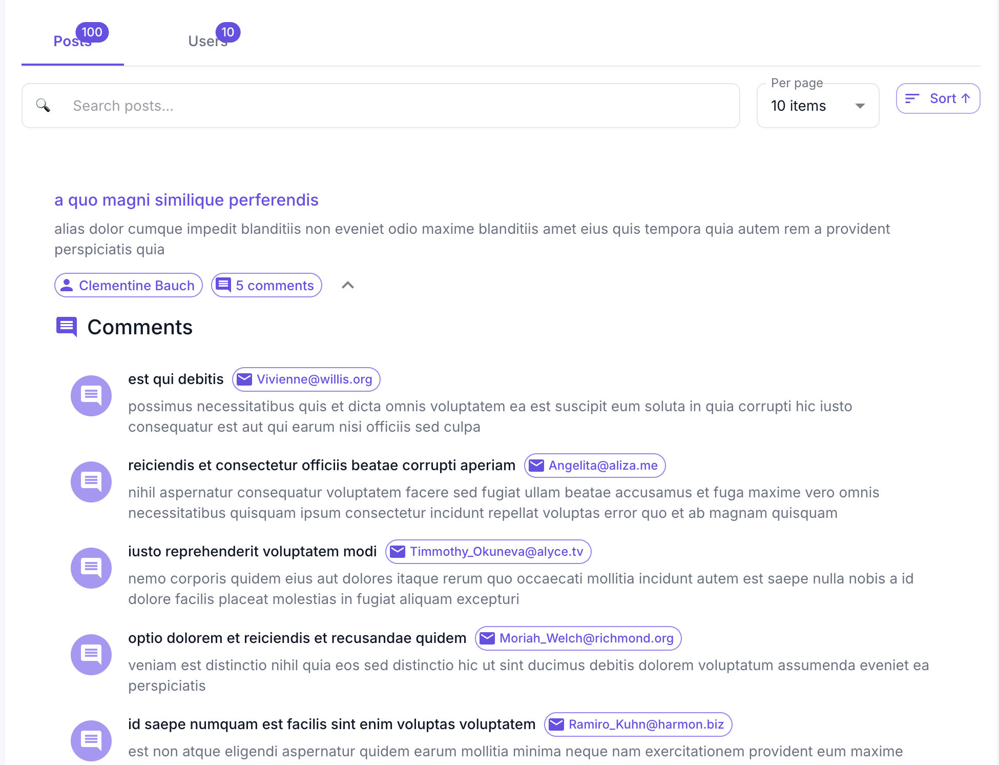
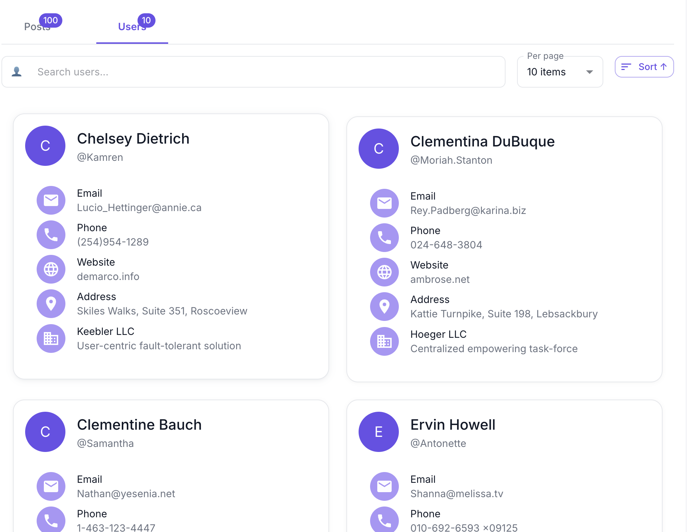
## 4. Technical Implementation Details

### State Management
- Uses React's useState and useEffect hooks
- Implements useTransition for better performance
- Manages loading states for async operations

### Error Handling
- Comprehensive error catching for API calls
- User-friendly error messages
- Fallback UI states

### Performance Optimization
- Pagination for large data sets
- Efficient data fetching with Promise.all
- Transition handling for state updates
- Caching of fetched data
- Optimized re-renders

### UI/UX Features
- Material-UI components
- Responsive design
- Loading indicators
- Sort and filter capabilities
- Search functionality
- Expandable/collapsible sections

## 5. Testing Infrastructure
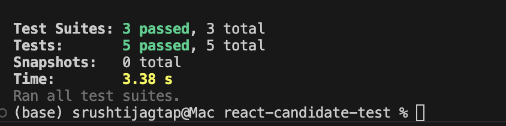

### Component Test Cases

#### 1. Weather Component Tests
- **File**: `Weather.test.tsx`
- **Test Cases**:
  - Renders weather component
  - Handles location search
  - Displays weather information
  - Shows loading states
  - Handles error states
  - Tests geolocation functionality
  - Validates temperature unit conversion

#### 2. Pokemon Component Tests
- **File**: `Pokemon.test.tsx`
- **Test Cases**:
  - Renders Pokemon component
  - Searches for Pokemon
  - Displays Pokemon details
  - Shows loading states
  - Handles error cases
  - Tests favorite functionality

#### 3. JsonPlaceholder Component Tests
- **File**: `JsonPlaceholder.test.tsx`
- **Test Cases**:
  - Renders JsonPlaceholder component
  - Fetches and displays posts
  - Handles pagination
  - Tests search functionality
  - Validates sorting
  - Checks comment threading
  - Tests error handling

### Testing Utilities
- React Testing Library for component testing
- Jest DOM for DOM manipulation assertions
- Mock Service Worker for API mocking
- User Event for simulating user interactions

### Test Categories
1. **Unit Tests**
   - Individual component testing
   - Function testing
   - Hook testing
   - Utility function testing

2. **Integration Tests**
   - Component interaction testing
   - API integration testing
   - State management testing
   - Route testing

3. **Snapshot Tests**
   - UI component snapshots
   - State snapshots
   - Error boundary testing

## 6. Navigation and Routing
- Added new routes for features
- Updated navigation menu

## 7. Additional Notes

### Development Environment
- React with TypeScript
- Material-UI for components
- Jest and React Testing Library for testing
- Modern ES6+ JavaScript features
- Responsive design principles
